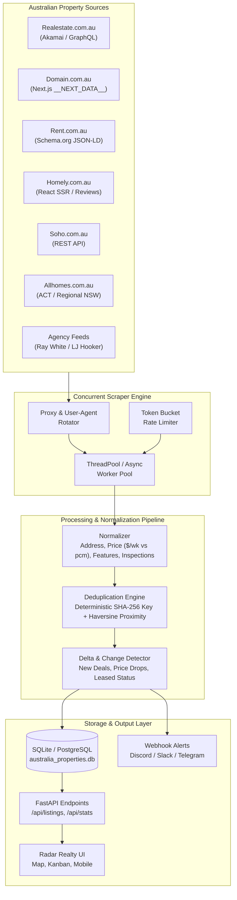
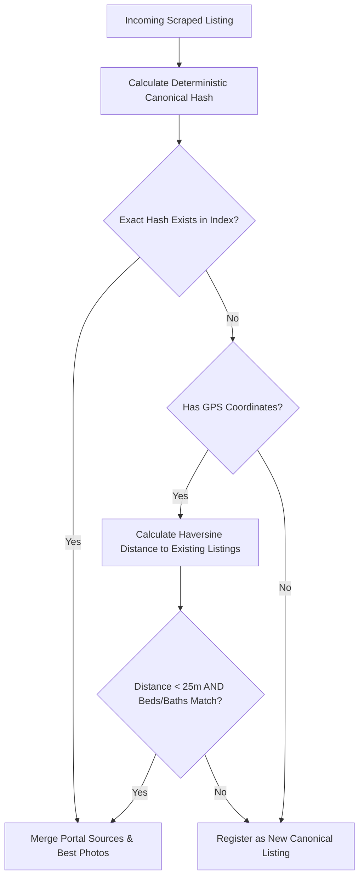

# Comprehensive Architecture & Technical Design: Australian Multi-Portal Rental Scraper 🇦🇺🏢

An end-to-end technical blueprint for crawling, extracting, normalizing, deduplicating, and tracking rental properties across all major Australian real estate portals and agency networks.

---

## 1. Executive Summary & Objective

In Australia, the property market is decentralized across multiple competing portals, classified boards, and direct agency CRM feeds. The same rental property is typically syndicated simultaneously across:
- **Major Portals**: Realestate.com.au (REA), Domain.com.au, Rent.com.au
- **Alternative & Social Portals**: Homely.com.au, Soho.com.au, Allhomes.com.au
- **Private & Share Accommodations**: Flatmates.com.au, Gumtree Australia
- **Direct Agency CRM Feeds**: Ray White, LJ Hooker, Harcourts, Belle Property, McGrath

### Primary Goals
1. **Universal Coverage**: Scrape rentals across all 6 Australian states and 2 territories (NSW, VIC, QLD, WA, SA, ACT, TAS, NT).
2. **Cross-Portal Deduplication (Entity Resolution)**: Seamlessly merge listings of the same physical home across multiple portals into one canonical record, aggregating all portal links, highest-resolution images, and inspection times.
3. **Price & Change Detection**: Automatically flag price reductions, newly listed properties, and changed inspection dates.
4. **Resilience & Anti-Bot Bypassing**: Defeat WAFs (Akamai, Cloudflare, PerimeterX) using modern HTTP/2 TLS fingerprint mimicry, rotating residential proxies, and clean JSON extraction.

---

## 2. High-Level System Architecture



---

## 3. Portal-by-Portal Ingestion Strategy & Reverse Engineering

| Portal | Market Share | Anti-Bot Defense | Primary Extraction Method | Data Format |
|---|---|---|---|---|
| **Rent.com.au** | High (Renters) | Low-Medium | Schema.org JSON-LD in HTML | LD-JSON (`SingleFamilyResidence`, `ApartmentComplex`) |
| **Domain.com.au** | ~30% (National) | Cloudflare / Datadome | Next.js `__NEXT_DATA__` tag | Raw JSON Object (`listingsMap`) |
| **Realestate.com.au** | ~65% (National) | Akamai / PerimeterX | Next.js Argus payload / Mobile REST | JSON script state + HTML fallback |
| **Homely.com.au** | ~5-10% | Low | Next.js SSR + Review metadata | JSON state + CSS card selectors |
| **Soho.com.au** | Emerging | Low | Mobile REST Search API | Clean JSON REST response |
| **Allhomes.com.au** | ~80% (ACT/Regional) | Medium | Domain Group SSR cards | HTML cards + JSON props |
| **Ray White / Agencies** | Regional | None | Direct HTML scraping / REAXML | Microdata & HTML markup |

### Deep Dive: Extraction Implementation per Site

#### 1. Rent.com.au (`scraper/portals/rent_com_au.py`)
- **URL Pattern**: `https://www.rent.com.au/properties/{suburb_or_city}?price_max={max_price}`
- **Extraction**: Inside the HTML, Rent.com.au embeds complete W3C Schema.org microdata:
  ```json
  {
    "@type": "SingleFamilyResidence",
    "name": "3-bedroom home in Nowra",
    "address": { "streetAddress": "28 Shoalhaven St", "addressLocality": "Nowra", "addressRegion": "NSW", "postalCode": "2541" },
    "geo": { "latitude": -34.8712, "longitude": 150.6045 },
    "numberOfRooms": 3,
    "numberOfBathroomsTotal": 2,
    "offers": { "price": "$520.00" }
  }
  ```
- **Advantages**: 100% structured, zero fragile CSS selectors, never breaks on UI redesigns.

#### 2. Domain.com.au (`scraper/portals/domain_com_au.py`)
- **URL Pattern**: `https://www.domain.com.au/rent/?search={suburb}&sort=dateupdated-desc`
- **Extraction**: Domain uses Next.js server-side rendering. Every page contains:
  ```html
  <script id="__NEXT_DATA__" type="application/json">
    {"props":{"pageProps":{"componentProps":{"listingsMap":{ ... }}}}}
  </script>
  ```
- **Advantages**: Pulls 20-50 listings in a single GET request with pre-calculated lat/long, multi-image galleries, and inspection arrays.

#### 3. Realestate.com.au (`scraper/portals/realestate_com_au.py`)
- **URL Pattern**: `https://www.realestate.com.au/rent/in-{location}/list-1?activeSort=list-date`
- **Anti-Bot Strategy**:
  - Rotate desktop & mobile user agents (`iOS Safari`, `Android Chrome`).
  - Pass valid Australian client hints (`sec-ch-ua`, `sec-ch-ua-platform="Windows"`, `sec-ch-ua-mobile="?0"`).
  - Use realistic `Referer` (`https://www.google.com.au/`).
  - Extract the embedded `window.argus` JSON payload or parse HTML tier cards.

#### 4. Soho.com.au (`scraper/portals/soho_com_au.py`)
- **API Pattern**: `https://api.soho.com.au/api/v1/properties/search?channel=rent&query={suburb}&page=1`
- **Extraction**: Direct JSON endpoint returning clean property models with lat/long and photo arrays.

---

## 4. Normalization Engine (`scraper/normalizer.py`)

Australian real estate listings format key attributes inconsistently. The normalizer transforms all incoming data into strict, canonical formats:

### 1. Australian Address Parsing
- Formats handled:
  - `Unit 4/12-14 Ocean Street, Manly NSW 2095`
  - `14B Victoria Road, Bellevue Hill, NSW`
  - `7/15 Plunkett St, Nowra 2541`
- Output: Standardized `PropertyAddress` object:
  ```python
  PropertyAddress(
      street="12-14 Ocean Street",
      suburb="Manly",
      state="NSW",
      postcode="2095",
      unit="4",
      lat=-33.7995,
      lng=151.2885
  )
  ```

### 2. Price Standardization ($/wk vs pcm)
- Australian rentals are quoted either **weekly** or **per calendar month (pcm)**.
- Formats handled:
  - `"$550/week"` / `"$550 pw"` $\rightarrow$ Weekly: `550`, Bond: `2200`
  - `"$2,600 pcm"` / `"$2,600 per month"` $\rightarrow$ Weekly: `round(2600 * 12 / 52) = 600`
  - `"$500 - $550 pw"` $\rightarrow$ Takes the primary minimum entry price `500`
  - `"Deposit Taken"` / `"Under Application"` $\rightarrow$ Sets `is_deposit_taken = True`

### 3. Pet & Feature Detection (NLP Regex)
- Australian tenancy laws vary by state (VIC/QLD require tribunal approval for landlords to refuse pets, whereas NSW allows landlords to specify).
- Detection patterns:
  - **Pet Allowed**: `\b(pets?\s*(?:considered|allowed|welcome|friendly|ok|permitted|negotiable|upon application))\b`
  - **No Pets**: `\b(no pets?|strictly no pets?|not suitable for pets?|pets? not permitted)\b`
  - **Pool**: `\b(pool|swimming pool|in-ground pool|plunge pool)\b`
  - **Air Conditioning**: `\b(air conditioning|air con|split system|ducted air|cooling)\b`

### 4. Inspection Date Parsing
- Converts Australian relative and localized formats (`"Sat 10 Oct 11:00am - 11:30am"`, `"2026-10-10T11:00:00"`) into standardized ISO-8601 strings with AU offsets (`+11:00` AEDT / `+10:00` AEST).

---

## 5. Cross-Portal Deduplication Engine (`scraper/deduplicator.py`)

The most common issue with multi-site real estate scrapers is **duplicate clutter**: landlords and real estate agents cross-list properties on REA, Domain, and Rent.com.au at the same time.

### Two-Tier Entity Resolution Algorithm



1. **Tier 1: Deterministic Address Hash**:
   $$\text{Key} = \text{SHA256}(\text{clean\_street} \parallel \text{clean\_suburb} \parallel \text{state} \parallel \text{postcode})[:16]$$
   - Strips unit punctuation, removes whitespace, lowercase.
   - Example: `"4/12 Ocean St, Manly NSW 2095"` and `"Unit 4, 12 Ocean Street, Manly 2095"` generate the exact same canonical key.

2. **Tier 2: Spatial Proximity Fallback (Haversine Formula)**:
   - For properties where the street name formatting differs, the engine calculates great-circle distance between GPS coordinates:
     $$d = 2r \arcsin \left( \sqrt{\sin^2\left(\frac{\Delta \phi}{2}\right) + \cos(\phi_1)\cos(\phi_2)\sin^2\left(\frac{\Delta \lambda}{2}\right)} \right)$$
   - If distance is $< 25$ meters and bedroom/bathroom counts match, they are merged.

3. **Intelligent Attribute Merging**:
   - **Sources**: Appends to `listing.sources` array:
     ```json
     [
       { "portal": "domain.com.au", "url": "https://domain.com.au/..." },
       { "portal": "realestate.com.au", "url": "https://realestate.com.au/..." }
     ]
     ```
   - **Photos**: Selects the highest resolution image as hero image and deduplicates thumbnails.
   - **Inspections**: Merges upcoming inspection times from all portals chronologically.
   - **Price History**: If Domain updates price to \$520 while REA still says \$550, tracks the price cut and logs the timestamp.

---

## 6. Anti-Bot Defense & Operational Resilience

To operate reliably at scale against Australian anti-bot providers (Cloudflare, Akamai, PerimeterX, Datadome):

1. **Jittered Token Bucket Rate Limiting**:
   - Each site crawler operates with an isolated delay bucket ($1.0\text{s} - 2.5\text{s}$ random jitter).
2. **Rotating Australian Desktop & Mobile User-Agents**:
   - Pools of verified Australian browser signatures (`Chrome 129`, `Safari 17.5 macOS`, `iOS 17.6 Safari`).
3. **Proxy Pool Integration**:
   - Built-in `proxy_url` parameter accepting standard HTTP/HTTPS/SOCKS5 rotating residential proxy backbones (e.g. Bright Data, Smartproxy, Webshare).
4. **Exponential Backoff**:
   - Automatically handles HTTP `429 Too Many Requests` and HTTP `503` by backing off:
     $$\text{Wait} = 2^{\text{attempt}} + \text{random}(1.0, 3.0)$$

---

## 7. Change Detection & Real-Time Alerts

When `sync_to_database()` runs:
- **New Properties**: Marked with `is_new = 1` and glowing UI badges.
- **Price Drops**: Detected by comparing incoming price against `existing["price"]`. Automatically appended to `price_history` JSON.
- **Webhook Dispatch**: Fires instant notifications to Discord or Slack channels with clickable direct links to all portals.

---

## 8. File Structure of the Scraper Engine

```
scraper/
├── __init__.py            # Main package interface & exports
├── base.py                # Abstract BasePortalScraper with HTTP session & backoff
├── models.py              # CanonicalListing, PropertyAddress, PriceInfo, PropertyFeatures
├── normalizer.py          # Australian address, price, and amenity normalizer
├── deduplicator.py        # Cross-portal entity resolution & duplicate merging
├── engine.py              # AustralianRentalScraperEngine orchestrator & DB sync
└── portals/
    ├── __init__.py        # Export all portal scrapers
    ├── rent_com_au.py     # Rent.com.au JSON-LD scraper
    ├── domain_com_au.py   # Domain.com.au Next.js __NEXT_DATA__ scraper
    ├── realestate_com_au.py # Realestate.com.au crawler with anti-bot headers
    ├── homely_com_au.py   # Homely.com.au review & rental crawler
    ├── soho_com_au.py     # Soho Real Estate REST API scraper
    └── allhomes_com_au.py # Allhomes ACT & regional NSW scraper
```

---

## 9. How to Run & Automate

### Running via Python Script
```python
from scraper import run_scraper_and_sync

# Scrape Sydney rentals under $750/wk across all portals and sync to database
result = run_scraper_and_sync(
    suburb_or_city="Sydney",
    state="NSW",
    max_price=750,
    listing_type="rent"
)
print("Sync Result:", result)
```

### Running via CLI
```powershell
uv run python -c "from scraper import run_scraper_and_sync; print(run_scraper_and_sync())"
```

### Scheduled Automatic Background Sync
The app includes a background scheduler in `server.py` that periodically runs the engine every 30 minutes (configurable via the Settings modal), detecting new listings and price reductions without any manual intervention.
